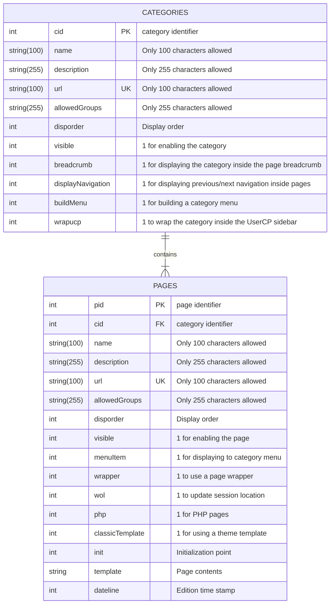

<p align="center">
    <a href="" rel="noopener">
        
    </a>
</p>

<h3 align="center">OUGC Pages</h3>

<div align="center">

[]()
[](./issues)
[](./pulls)
[](/LICENSE)

</div>

---

<p align="center"> Create additional HTML or PHP pages directly from the Administrator Control Panel.
    <br> 
</p>

## 📜 Table of Contents <a name = "table_of_contents"></a>

- [About](#about)
- [Getting Started](#getting_started)
    - [Dependencies](#dependencies)
    - [File Structure](#file_structure)
    - [Database Entity Relationship](#db_er_model)
    - [Install](#install)
    - [Update](#update)
    - [Template Modifications](#template_modifications)
- [Settings](#settings)
    - [File Level Settings](#file_level_settings)
    - [Enable PHP Pages](#settings_enable_php)
    - [Configure Friendly Urls](#settings_friendly_urls)
- [Templates](#templates)
- [Usage](#usage)
    - [Categories](#usage_categories)
    - [Pages](#usage_pages)
    - [Example Pages](#example_pages)
    - [Third Party Support](#third_party)
- [Plugins](#plugins)
    - [Global Scope](#plugin_global)
    - [Hooks](#plugin_hooks)
    - [Methods](#plugin_methods)
    - [Constants](#plugin_constants)
- [Built Using](#built_using)
- [Authors](#authors)
- [Acknowledgments](#acknowledgement)
- [Support & Feedback](#support)

## 🚀 About <a name = "about"></a>

OUGC Pages is a versatile and feature-rich PHP plugin designed for MyBB forum administrators. It empowers administrators
to effortlessly create, manage, and customize unlimited HTML or PHP pages within their forum. With this plugin,
administrators can enhance their forum's functionality by adding unique and personalized content.

The plugin offers a user-friendly interface for creating, editing, and organizing pages, while its SEO-friendly URLs
ensure optimal search engine visibility. Administrators can take advantage of features like seamless page export and
import, extensive group access permissions, unlimited page categories, and automatic menu creation. From About Us pages
to FAQ sections and more, it provides a comprehensive solution for creating engaging and dynamic custom content within
MyBB forums.

[Go up to Table of Contents](#table_of_contents)

## 📍 Getting Started <a name = "getting_started"></a>

The following information will assist you into getting a copy of this plugin up and running on your forum.

### Dependencies <a name = "dependencies"></a>

A setup that meets the following requirements is necessary to use this plugin.

- [MyBB](https://mybb.com/) >= 1.8
- PHP >= 7
- [MyBB-PluginLibrary](https://github.com/frostschutz/MyBB-PluginLibrary) >= 13

### File structure <a name = "file_structure"></a>

  ```
   .
   ├── inc
   │ ├── plugins
   │ │ ├── ougc
   │ │ │ ├── Pages
   │ │ │ │ ├── admin
   │ │ │ │ │ ├── module.php
   │ │ │ │ ├── templates
   │ │ │ │ │ ├── .html
   │ │ │ │ │ ├── adminCategoryName.html
   │ │ │ │ │ ├── adminCategoryStatus.html
   │ │ │ │ │ ├── adminCodeMirror.html
   │ │ │ │ │ ├── adminCodeMirrorFooter.html
   │ │ │ │ │ ├── adminGroupSelect.html
   │ │ │ │ │ ├── adminPageName.html
   │ │ │ │ │ ├── category_link.html
   │ │ │ │ │ ├── category_list.html
   │ │ │ │ │ ├── category_list_empty.html
   │ │ │ │ │ ├── category_list_item.html
   │ │ │ │ │ ├── menu.html
   │ │ │ │ │ ├── menu_css.html
   │ │ │ │ │ ├── menu_item.html
   │ │ │ │ │ ├── navigation.html
   │ │ │ │ │ ├── navigation_next.html
   │ │ │ │ │ ├── navigation_previous.html
   │ │ │ │ │ ├── page_link.html
   │ │ │ │ │ ├── wrapper.html
   │ │ │ │ │ ├── wrapper_edited.html
   │ │ │ │ │ ├── wrapper_ucp.html
   │ │ │ │ │ ├── wrapper_ucp_nav.html
   │ │ │ │ │ ├── wrapper_ucp_nav_item.html
   │ │ │ │ ├── admin.php
   │ │ │ │ ├── adminHooks.php
   │ │ │ │ ├── core.php
   │ │ │ │ ├── forumHooks.php
   │ │ │ │ ├── settings.json
   │ │ ├── ougc_pages.php
   │ ├── languages
   │ │ ├── espanol
   │ │ │ ├── ougc_pages.lang.php
   │ │ │ ├── admin
   │ │ │ │ ├── config_ougc_pages.lang.php
   │ │ ├── english
   │ │ │ ├── ougc_pages.lang.php
   │ │ │ ├── admin
   │ │ │ │ ├── config_ougc_pages.lang.php
   ├── admin
   │ ├── modules
   │ │ ├── config
   │ │ │ ├──ougc_pages.php
   └── pages.php
   ```

### Database Entity Relationship <a name = "db_er_model"></a>

---
Categories and Pages Entity Relationship
---



### Installing <a name = "install"></a>

Follow the next steps in order to install a copy of this plugin on your forum.

1. Download the latest package from the [MyBB Extend](https://community.mybb.com/mods.php?action=view&pid=6) site or
   from the [repository releases](https://github.com/OUGC-Network/OUGC-Pages/releases/latest).
2. Upload the contents of the _Upload_ folder to your MyBB root directory.
3. Browse to _Configuration » Plugins_ and install this plugin by clicking _Install & Activate_.
4. Browse to _Configuration » Manage Pages_ to create page categories and pages.

### Updating <a name = "update"></a>

Follow the next steps in order to update your copy of this plugin.

1. Browse to _Configuration » Plugins_ and deactivate this plugin by clicking _Deactivate_.
2. Follow step 1 and 2 from the [Install](#install) section.
3. Browse to _Configuration » Plugins_ and activate this plugin by clicking _Activate_.
4. Browse to _Configuration » Manage Pages_ to create page categories and pages.

**If you are updating to <ins>1.8.33</ins> from any previous version:**

1. After following the above steps, make sure to review your settings, templates, categories, and pages, as they
   suffered major updates for this version.

### Template Modifications <a name = "template_modifications"></a>

The building of category menus requires that you edit the `header` template for each of your themes.

1. Open the `header` template for editing.
2. Find `<li><a href="{$mybb->settings['bburl']}/misc.php?action=help" class="help">{$lang->toplinks_help}</a></li>`.
3. Add `<!--OUGC_PAGES_FOOTER-->` right after.
4. Save the template.

[Go up to Table of Contents](#table_of_contents)

## 🛠 Settings <a name = "settings"></a>

Below you can find a description of the plugin settings.

### Global Settings

- **Use SEO friendly URLs** `yesNo` Key: `seo` Default: `no`
    - _Whether if to enable SEO friendly URLs for pages._
- **Page URL Scheme** `text` Key: `seo_scheme` Default: `page-{url}`
    - _Enter the Page URL scheme. Leave empty to disable SEO URLs for Pages._
- **Category URL Scheme** `text` Key: `seo_scheme_categories` Default: `category-{url}`
    - _Enter the Category URL scheme. Leave empty to disable SEO URLs for Categories._
- **Items Per Page** `numeric` Key: `perpage` Default: `20`
    - _Maximum number of items to show per page in the ACP list._
- **UserCP Nav Priority** `select` Key: `usercp_priority` Default: `40`
    - _The priority given to UserCP navigation categories._

### File Level Settings <a name = "file_level_settings"></a>

Additionally, you can force your settings by updating the `SETTINGS` array constant in the `ougc\Pages\Core`
namespace in the `./inc/plugins/ougc_pages.php` file. Any setting set this way will always bypass any front-end
configuration. Use the setting key as shown below:

```PHP
define('ougc\Pages\Core\SETTINGS', [
    'seo' => false,
    'seo_scheme' => 'page-{url}',
    'seo_scheme_categories' => 'category-{url}',
    'perpage' => 20,
    'usercp_priority' => 40
]);
```

### Enable PHP Pages <a name = "settings_enable_php"></a>

PHP code is disabled by default when uploading the plugin files. You can allow `initExecute()` to run `eval()` by
setting the `enableEval` setting to `true`. This setting can not be set from the front-end and has to be set by
editing the plugin settings at file-level in the `./inc/plugins/ougc_pages.php` file:

```PHP
define('ougc\Pages\Core\SETTINGS', [
    'enableEval' => true
]);
```

### Configure Friendly Urls <a name = "settings_friendly_urls"></a>

To successfully use friendly urls for your page categories and pages, you need to follow the next steps:

1. Enable the _Use SEO friendly URLs_ global setting.
2. Update your `.htaccess` or your NGINX configuration file to include the necessary rewrite rules.

The following would be the rewrite rules for `.htacccess` when using the default URL schemes:

```
RewriteRule ^category\-([^./]+)/?$ pages.php?category=$1 [L,QSA,NC]
RewriteRule ^page\-([^./]+)/?$ pages.php?page=$1 [L,QSA,NC]
```

The following would be the rewrite rules for NGINX when using the default URL schemes:

```
rewrite ^/((?i)category-([^./]+))$ /pages.php?category=$2;
rewrite ^/((?i)page-([^./]+))$ /pages.php?page=$2;
```

[Go up to Table of Contents](#table_of_contents)

## 📐 Templates <a name = "templates"></a>

The following is a list of templates available for this plugin. Uncommon in plugins, we use some templates exclusively
for the
_Administrator Control Panel_.

- `ougcpages`
    - _front end_; used when viewing a category or non-PHP pages
- `ougcpages_adminCategoryName`
    - _back end_; used when viewing categories
- `ougcpages_adminCategoryStatus`
    - _back end_; used when viewing a category or page
- `ougcpages_adminCodeMirror`
    - _back end_; used when adding or editing a page
- `ougcpages_adminCodeMirrorFooter`
    - _back end_; used when adding or editing a page
- `ougcpages_adminGroupSelect`
    - _back end_; used when adding or editing a category or page
- `ougcpages_category_link`
    - _back end_; used for building a category link
- `ougcpages_page_link`
    - _back end_; used for building a page link
- `ougcpages_adminPageName`
    - _back end_; used when viewing pages in a category
- `ougcpages_category_list`
    - _front end_; used when viewing a category
- `ougcpages_category_list_empty`
    - _front end_; used when viewing a category
- `ougcpages_category_list_item`
    - _front end_; used when viewing a category
- `ougcpages_menu`
    - _front end_; used when category `buildMenu` is `1`
- `ougcpages_menu_css`
    - _front end_; used when category `buildMenu` is `1`
- `ougcpages_menu_item`
    - _front end_; used when category `buildMenu` is `1`
- `ougcpages_navigation`
    - _front end_; used when category `displayNavigation` is `1`
- `ougcpages_navigation_next`
    - _front end_; used when category `displayNavigation` is `1`
- `ougcpages_navigation_previous`
    - _front end_; used when category `displayNavigation` is `1`
- `ougcpages_wrapper`
    - _front end_; used when page `wrapper` is `1`
- `ougcpages_wrapper_edited`
    - _front end_; used page category `wrapper` is `1`
- `ougcpages_wrapper_ucp`
    - _front end_; used when category `wrapucp` is `1`
- `ougcpages_wrapper_ucp_nav`
    - _front end_; used when category `wrapucp` is `1`
- `ougcpages_wrapper_ucp_nav_item`
    - _front end_; used when category `wrapucp` is `1`

[Go up to Table of Contents](#table_of_contents)

## 📖 Usage <a name="usage"></a>

The following is a description of the _Administrator Control Panel_ module form fields.

### Categories: Main <a name="usage_categories"></a>

- **Display Order** `text`
    - _The display order for each category._
- **Status** `text`
    - _Toggle category enabled status._

### Categories: Add or Edit

- **Category Name** `text`
    - _Display name for this category._
- **Category Description** `text`
    - _Insert the description for this category._
- **Unique URL** `text`
    - _Insert the unique URL identifier for this category._
- **Viewable for Groups** `select` Default: `all`
    - _Select the groups that are allowed to browse this category._
- **Display in Breadcrumb** `yesNo` Default: `yes`
    - _Toggle to display this category in the navigation breadcrumb._
- **Show Navigation** `yesNo` Default: `yes`
    - _Toggle to show a previous/next pagination when browsing pages in this category._
- **Build Menu** `yesNo` Default: `yes`
    - _Toggle to build a dropdown menu for this category in the header._
- **Wrap UserCP Menu** `yesNo` Default: `no`
    - _If enabled, a section will be added to the UserCP for browsing this category and the category will be wrapped as
      if it was a UserCP section. Beware of errors if you allow guest access._

### Pages: Main <a name="usage_pages"></a>

- **Display Order** `text`
    - _The display order for each category._
- **Status** `text`
    - _Toggle category enabled status._

### Pages: Add or Edit

- **Category** `select`
    - _Select the category this page belongs to._
- **Page Name** `text`
    - _Display name for this page._
- **Page Description** `text`
    - _Insert the description for this page._
- **Unique URL** `text`
    - _Insert the unique URL identifier for this page._
- **Viewable for Groups** `select` Default: `all`
    - _Select the groups that are allowed to see this page._
- **Add to Menu** `yesNo` Default: `yes`
    - _If "Build Menu" is enabled for this category, add link to this page in it._
- **Use Template Wrapper** `yesNo` Default: `yes`
    - _If enabled, the contents of non-PHP pages will be wrapped within the `ougcpages_wrapper` template._
- **Show In Who Is Online (WOL) List** `yesNo` Default: `yes`
    - _If disabled, activity within this page will be displayed as "Unknown location" pointing to the home page._
- **Eval PHP Code** `yesNo` Default: `no` <span style="color: orange;">*
  See [Enable PHP Pages](#settings_enable_php).</span>
    - _If enabled, this page wilL be parsed as plain PHP code. Disable to use HTML content instead._
- **Use Theme Template** `yesNo` Default: `no`
    - _If enabled, the "Page Content" below will be ignored and a theme template will be used instead. The name for the
      template should follow the format `ougcpages_pagePID`, for example: `ougcpages_page18`_
- **PHP Initialization Point** `select`
    - _Select the script section where this page should be loaded in when "Eval PHP Code" is enabled._
        - _**Initialization:** Not even all plugins are checked at this point. Very low resource consumption. Around 4-6
          queries are ran by this point._
        - _**Global Start:** Mainly only session and language have been loaded. Around 6-8 queries are ran by this
          point._
        - _**Global Intermediate:** Theme and templates have been loaded without header, welcome block, or footer being
          available yet. Around 8-10 queries are ran by this point._
        - _**Global End:** Default; if unsure select this. Has the most compatibility for all forum features. Around
          9-13 queries are ran by this point._
- **Page Content** `text`
    - _Insert the page HTML or PHP content below._

### Pages: Import <a name="usage_categories"></a>

- **Local File** `file`
    - _Select the XML file to import from your computer._
- **URL File** `text`
    - _Insert the URL of the XML file to import._
- **Ignore Version Compatibility** `yesNo` Default: `yes`
    - _Should this page be imported regardless of the version of OUGC Pages or Page Manager it was created for?._

### Example Pages <a name="example_pages"></a>

The download package ships with nine example pages that can be used as production pages or as a reference for designing
custom pages.

[Browse Files](https://github.com/OUGC-Network/OUGC-Pages/blob/master/Examples/)

- **Forum stats signature** File: `Signature/OUGC_Pages_Signature.xml`
    - A dynamically generated signature image that displays stats about your forum.
- **Banned List** File: `OUGC_Pages_Banned_List.xml`
    - Displays a list of banned accounts.
- **HTML Test Page** File: `OUGC_Pages_HTML_Test_Page.xml`
    - Plain HTML page meant to serve as reference.
- **List Profile Fields** File: `OUGC_Pages_List_Profile_Fields.xml`
    - Displays a list of users and their custom profile fields values.
- **New Thread** File: `OUGC_Pages_New_Thread.xml`
    - A new thread page meant to serve as reference.
- **PHP Test Page** File: `OUGC_Pages_PHP_Test_Page.xml`
    - Basic PHP page that uses the MyBB parser meant to serve as reference.
- **Profile Fields** File: `OUGC_Pages_Profile_Fields.xml`
    - Allow users to update their custom profile fields.
- **ShoutBox Page** File: `OUGC_Pages_ShoutBox_Page.xml`
    - Displays the DVZ Shoutbox in a custom PHP page.
- **Sticky Threads** File: `OUGC_Pages_Sticky_Threads.xml`
    - Displays a list with all sticky threads.

### Third Party Support <a name="third_party"></a>

Below is a list and short description of any compatibility with third party MyBB plugins.

- [PHP in Templates](http://mybbhacks.zingaburga.com/showthread.php?tid=260) / [Template Conditionals](http://mybbhacks.zingaburga.com/showthread.php?tid=464)
    - If installed, you should be able to use any allowed syntax, expression, or tags inside the _Page
      Content_ for pages, as this page field is parsed as a template.

[Go up to Table of Contents](#table_of_contents)

## 🧩 Plugins <a name="plugins"></a>

Provides a list of available variables, functions, and methods for plugins to use.

### Variables available at the global scope: <a name="plugin_global"></a>

- `(array) $categoriesCache` array containing cached categories data when `visible` is equal to `1` and `allowedGroups`
  is not empty, ordered by `cid, disporder`, array key is set to category identifier `cid`:
    - `(string) name`
    - `(string) description`
    - `(string) url`
    - `(string) allowedGroups`
        - `-1` for all groups
        - CSV for allowed groups
    - `(int) breadcrumb`
    - `(int) displayNavigation`
    - `(int) buildMenu`
    - `(int) wrapucp`
- `(array) $pagesCache` array containing cached pages data when `visible` is equal to `1` and `allowedGroups` is not
  empty, ordered by `pid, disporder`, array key is set to page identifier `pid`:
    - `(int) cid`
    - `(string) name`
    - `(string) description`
    - `(string) url`
    - `(string) allowedGroups`
        - `-1` for all groups
        - CSV for allowed groups
    - `(int) menuItem`
    - `(int) wrapper`
    - `(int) wol`
    - `(int) php`
    - `(int) classicTemplate`
    - `(int) init`
    - `(int) dateline`
- `(bool) $isCategory` `true` if current page is a category.
- `(bool) $isPage``true` if current page is a page.
- `(int) $categoryID` current category identifier.
- `(int) $pageID` current page identifier, `0` when `$isPage` is `false`.
- `(array) $categoryData` array containing current category page:
    - `(string) name`
    - `(string) description`
    - `(string) url`
    - `(string) allowedGroups`
        - `-1` for all groups
        - CSV for allowed groups
    - `(int) breadcrumb`
    - `(int) displayNavigation`
    - `(int) buildMenu`
    - `(int) wrapucp`
- `(array) $pageData` array containing current page, empty when `$isPage` is `false`.
    - `(int) cid`
    - `(string) name`
    - `(string) description`
    - `(string) url`
    - `(string) allowedGroups`
        - `-1` for all groups
        - CSV for allowed groups
    - `(int) menuItem`
    - `(int) wrapper`
    - `(int) wol`
    - `(int) php`
    - `(int) classicTemplate`
    - `(int) init`
    - `(string) template`
    - `(int) dateline`

### List of available hooks: <a name="plugin_hooks"></a>

- `ougcPagesExecutionInit`
- `ougcPagesExecutionGlobalStart`
- `ougcPagesExecutionGlobalIntermediate`
- `ougcPagesExecutionGlobalEnd`
- `oucPagesCategoryInsertEnd` Array object is passed by reference with the following variables:
- `oucPagesCategoryUpdateEnd` Array object is passed by reference with the following variables:
    - `(array) categoryID` inserted/updated category identifier.
    - `(array) categoryData` array containing category data (not always available)
        - `(string) name`
        - `(string) description`
        - `(string) url`
        - `(string) allowedGroups`
            - `-1` for all groups
            - CSV for allowed groups
            - empty for none
        - `(int) disporder`
        - `(int) visible`
        - `(int) breadcrumb`
        - `(int) displayNavigation`
        - `(int) buildMenu`
        - `(int) wrapucp`
- `oucPagesCategoryDeleteEnd` Variable passed by reference:
    - `(int) $categoryID` deleted page identifier.
- `oucPagesPageInsertEnd` Array object is passed by reference with the following variables:
- `oucPagesPageUpdateEnd` Array object is passed by reference with the following variables:
    - `(array) pageID` inserted/updated page identifier.
    - `(array) pageData` array containing page data (not always available)
        - `(int) cid`
        - `(string) name`
        - `(string) description`
        - `(string) url`
        - `(string) allowedGroups`
            - `-1` for all groups
            - CSV for allowed groups
            - empty for none
        - `(int) disporder`
        - `(int) visible`
        - `(int) menuItem`
        - `(int) wrapper`
        - `(int) wol`
        - `(int) php`
        - `(int) classicTemplate`
        - `(int) init`
        - `(string) template`
        - `(int) dateline`
- `oucPagesPageDeleteEnd` Variable passed by reference:
    - `(int) $pageID` deleted page identifier.
- `oucPagesStart`
- `oucPagesEnd`

### List of available methods at the `ougc\Pages\Core` namespace: <a name="plugin_methods"></a>

- `loadLanguage(): void { ... }`
- `getSetting(string $settingKey = ''): string { ... }`
- `cacheUpdate(): void { ... }`
- `cacheGetPages(): array { ... }`
- `cacheGetCategories(): array { ... }`
- `initExecute(int $pageID): never { ... }`
- `initSession(): void { ... }`
- `categoryInsert(array $inputData = [], int $categoryID = 0, bool $doUpdate = false): int { ... }`
- `categoryUpdate(array $inputData = [], int $categoryID = 0): int { ... }`
- `categoryDelete(int $categoryID): bool { ... }`
- `categoryGet(int $categoryID, string $categoryUrl = ''): array { ... }`
- `categoryQuery(array $fieldList = ['*'], array $whereConditions = ['1=1'], array $queryOptions = []): array { ... }`
- `categoryGetByUrl(string $categoryUrl): array { ... }`
- `categoryGetLink(int $categoryID): string { ... }`
- `pageInsert(array $inputData = [], int $pageID = 0, bool $doUpdate = false): int { ... }`
- `pageUpdate(array $inputData = [], int $pageID = 0): int { ... }`
- `pageDelete(int $pageID): int { ... }`
- `pageGet(int $pageID, string $pageUrl = ''): array { ... }`
- `pageQuery(array $fieldList = ['*'], array $whereConditions = ['1=1'], array $queryOptions = []): array { ... }`
- `pageGetByUrl(string $url): array { ... }`
- `pageGetLink(int $pageID): string { ... }`

### List of available constants

The following is a list of constants are defined dynamically, `defined()`should be used to make sure they are defined.

- `OUGC_PAGES_STATUS_IS_CATEGORY`
    - `int` defined as the category identifier when trying to view a valid category
- `OUGC_PAGES_STATUS_IS_PAGE`
    - `int` defined as the page identifier when trying to view a valid page
- `OUGC_PAGES_STATUS_CATEGORY_INVALID`
    - `bool` defined as `true` when trying to view an invalid category
- `OUGC_PAGES_STATUS_CATEGORY_NO_PERMISSION`
    - `bool` defined as `true` when permission to view a category is denied
- `OUGC_PAGES_STATUS_PAGE_INVALID`
    - `bool` defined as `true` when trying to view an invalid page
- `OUGC_PAGES_STATUS_PAGE_NO_PERMISSION`
    - `bool` defined as `true` when permission to view a page is denied
- `OUGC_PAGES_STATUS_PAGE_INIT_GLOBAL_START`
    - `int` defined as the page identifier when trying to view a valid page which `php` value is `1` and `init` value
      is `2`
- `OUGC_PAGES_STATUS_PAGE_INIT_GLOBAL_INTERMEDIATE`
    - `int` defined as the page identifier when trying to view a valid page which `php` value is `1` and `init` value
      is `3`

[Go up to Table of Contents](#table_of_contents)

## ⛏ Built Using <a name = "built_using"></a>

- [MyBB](https://mybb.com/) - Web Framework
- [MyBB PluginLibrary](https://github.com/frostschutz/MyBB-PluginLibrary) - A collection of useful functions for MyBB
- [PHP](https://www.php.net/) - Server Environment

[Go up to Table of Contents](#table_of_contents)

## ✍️ Authors <a name = "authors"></a>

- [@Omar G](https://github.com/Sama34) - Idea & Initial work

See also the list of [contributors](https://github.com/OUGC-Network/OUGC-Pages/contributors) who participated in this
project.

[Go up to Table of Contents](#table_of_contents)

## 🎉 Acknowledgements <a name = "acknowledgement"></a>

- [The Documentation Compendium](https://github.com/kylelobo/The-Documentation-Compendium)

[Go up to Table of Contents](#table_of_contents)

## 🎈 Support & Feedback <a name="support"></a>

This is free development and any contribution is welcome. Get support or leave feedback at the
official [MyBB Community](https://community.mybb.com/thread-159249.html).

Thanks for downloading and using our plugins!

[Go up to Table of Contents](#table_of_contents)